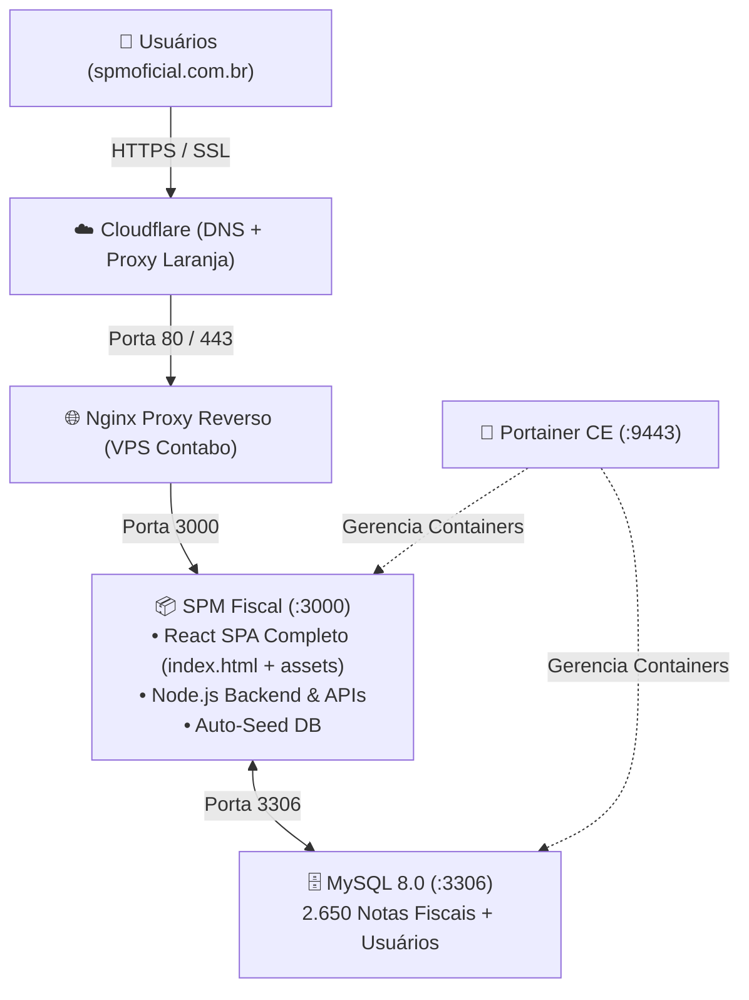

# 🚀 Guia Definitivo de Deploy: VPS Contabo + Docker + Portainer + Cloudflare
### Domínio Oficial: `https://spmstore.spmoficial.com.br`

---

## 📑 Sumário
1. [Diagnóstico: Por que o sistema subia incompleto?](#-diagnóstico-por-que-o-sistema-subia-incompleto)
2. [Arquitetura 100% Autocontida](#-arquitetura-100-autocontida)
3. [Passo 1: Atualizar o Repositório Git (GitHub)](#-passo-1-atualizar-o-repositório-git)
4. [Passo 2: Deploy na VPS Contabo](#-passo-2-deploy-na-vps-contabo)
5. [Passo 3: Subir a Stack no Portainer CE](#-passo-3-subir-a-stack-no-portainer-ce)
6. [Passo 4: Configuração Cloudflare (DNS + SSL)](#-passo-4-configuração-cloudflare-dns--ssl)
7. [Credenciais de Acesso & Contas Padrão](#-credenciais-de-acesso--contas-padrão)
8. [Perguntas Frequentes & Resolução de Problemas](#-perguntas-frequentes--resolução-de-problemas)

---

## 🔍 Diagnóstico: Por que o sistema subia incompleto?

Identificamos os 4 motivos exatos que faziam o deploy subir incompleto:

1. **Volume host `./dist:/app/dist` no Docker Compose**: Ao rodar no Portainer ou VPS sem que a pasta `dist` existisse com os arquivos compilados no host, o Docker montava uma pasta vazia por cima de `/app/dist`, apagando o frontend React compilado (`index.html` e `assets/`).
2. **Arquivos ausentes no estágio Runner do Dockerfile**: O `Dockerfile` compilava na fase builder, mas não copiava a pasta `data/` (com os municípios do IBGE e dados locais) nem o `database_spm_fiscal.sql` para dentro do container final.
3. **Banco de Dados MySQL Inicializado Vazio**: No Portainer, montar `./database_spm_fiscal.sql` direto pelo Web Editor falhava porque o arquivo não existia no diretório temporário do Portainer, resultando em 0 notas, 0 usuários e tela em branco.
4. **Endpoint de Healthcheck `/api/health` Inexistente**: O Docker Compose tentava verificar a saúde chamando `/api/health`, mas a rota não existia, fazendo o container ser marcado como `unhealthy`.

### ✅ O que foi corrigido:
- **Frontend & Backend 100% Integrados no Docker**: O container agora contém a compilação completa do Vite React (`dist/index.html` e `dist/assets/*`) e o backend `dist/server.cjs`. O volume conflitante `./dist` foi removido.
- **Auto-Seed Automático do MySQL**: Ao iniciar pela primeira vez (mesmo com volume de banco zerado), o backend detecta que a base está vazia e executa automaticamente o `database_spm_fiscal.sql`, populando todas as **2.650 notas fiscais**, regras de alerta, configurações e usuários.
- **Contas de Acesso Garantidas**: Usuários Administrador (`josegaldino@hotmail.com.br`), Gerente e Auditor são criados automaticamente com senhas criptografadas em bcrypt.
- **Healthcheck Nativo**: Adicionado endpoint `/api/health` e checagem nativa via Node.js fetch (sem dependência de wget).
- **Index HTML Completo**: Meta tags, fontes Google (`Plus Jakarta Sans` e `JetBrains Mono`) e Favicon SVG oficial integrados.

---

## 🏗️ Arquitetura 100% Autocontida



---

## 📤 Passo 1: Atualizar o Repositório Git

Para garantir que a VPS e o Portainer baixem todos os novos componentes, envie as alterações para o GitHub:

No seu computador (terminal do projeto em `c:\xampp\htdocs\spmfiscal`):
```bash
git add .
git commit -m "Deploy completo SPM Fiscal: Dockerfile atualizado, dist compilado, banco auto-seed e index completo"
git push origin main
```

---

## 🖥️ Passo 2: Deploy na VPS Contabo

### 1. Conectar na VPS via SSH
```bash
ssh root@SEU_IP_DA_CONTABO
```

### 2. Baixar/Atualizar o Projeto
```bash
cd /opt
# Se for a primeira vez:
git clone https://github.com/spmstoreoficial/spmfiscal.git
cd /opt/spmfiscal

# Se o projeto já existe na VPS:
cd /opt/spmfiscal
git pull origin main
```

### 3. Rodar o Script de Deploy Automatizado
```bash
chmod +x deploy.sh
./deploy.sh
```
O script cuidará de tudo: atualizará o Ubuntu, instalará Docker, subirá o Portainer na porta `9443`, compilará a aplicação SPM Fiscal e subirá os containers.

---

## 🐳 Passo 3: Subir a Stack no Portainer CE

Se você prefere gerenciar e subir tudo diretamente pela interface visual do Portainer:

1. Acesse o Portainer no seu navegador:
   ```
   https://SEU_IP_DA_CONTABO:9443
   ```
2. No menu lateral, clique em **Stacks** > **Add stack**.
3. Defina o nome: `spm-fiscal`.

### Opção A: Via Git Repository (Mais Recomendada)
- Selecione o método: **Repository**.
- **Repository URL**: `https://github.com/spmstoreoficial/spmfiscal.git`
- **Repository reference**: `refs/heads/main`
- **Compose path**: `docker-compose.portainer.yml`
- Ative **Automatic updates** (opcional - atualiza sempre que você der push no GitHub).
- Clique no botão **Deploy the stack**.

### Opção B: Via Web Editor (Com repositório já clonado em `/opt/spmfiscal`)
No editor de texto do Portainer, cole o conteúdo do arquivo [`docker-compose.portainer.yml`](docker-compose.portainer.yml):

```yaml
version: '3.8'

services:
  mysql:
    image: mysql:8.0
    container_name: spm-mysql
    restart: always
    environment:
      MYSQL_ROOT_PASSWORD: ${DB_PASSWORD:-spm_fiscal_root_pass_2026!}
      MYSQL_DATABASE: ${DB_NAME:-spm_fiscal}
      TZ: America/Sao_Paulo
    ports:
      - "3306:3306"
    volumes:
      - spm_mysql_data:/var/lib/mysql
    healthcheck:
      test: ["CMD", "mysqladmin", "ping", "-h", "localhost"]
      interval: 10s
      timeout: 5s
      retries: 10
      start_period: 20s

  spm-fiscal:
    build:
      context: .
      dockerfile: Dockerfile
    image: spm-fiscal:latest
    container_name: spm-fiscal
    restart: always
    ports:
      - "3000:3000"
    environment:
      NODE_ENV: production
      PORT: "3000"
      DB_HOST: mysql
      DB_PORT: "3306"
      DB_USER: root
      DB_PASSWORD: ${DB_PASSWORD:-spm_fiscal_root_pass_2026!}
      DB_NAME: ${DB_NAME:-spm_fiscal}
      JWT_SECRET: ${JWT_SECRET:-spm_store_ultra_secure_jwt_token_prod_2026_fiscal_elite}
      APP_URL: ${APP_URL:-https://spmstore.spmoficial.com.br}
      TZ: America/Sao_Paulo
    volumes:
      - spm_notas_fiscais:/app/Notas_Fiscais
      - spm_data:/app/data
      - spm_uploads:/app/uploads
    depends_on:
      mysql:
        condition: service_healthy
    healthcheck:
      test: ["CMD", "node", "-e", "fetch('http://localhost:3000/api/health').then(r => r.ok ? process.exit(0) : process.exit(1)).catch(() => process.exit(1))"]
      interval: 30s
      timeout: 10s
      retries: 5
      start_period: 25s

volumes:
  spm_mysql_data:
    driver: local
  spm_notas_fiscais:
    driver: local
  spm_data:
    driver: local
  spm_uploads:
    driver: local
```

Clique em **Deploy the stack**. O Portainer irá inicializar os dois serviços com sucesso!

---

## ☁️ Passo 4: Configuração Cloudflare (DNS + SSL)

1. Acesse o painel Cloudflare: https://dash.cloudflare.com
2. Selecione a zona do seu domínio `spmoficial.com.br`.
3. Em **DNS > Records**, adicione ou edite o registro:
   - **Tipo**: `A`
   - **Nome (Name)**: `spmstore`
   - **IPv4 address**: `SEU_IP_DA_CONTABO`
   - **Proxy status**: **Proxied (Nuvem Laranja 🟧)** para SSL automático e proteção Cloudflare
   - **TTL**: Auto
4. Em **SSL/TLS > Overview**, certifique-se de que está em: **Full** (ou **Flexible** se não houver SSL local na VPS).
5. Em **SSL/TLS > Edge Certificates**, ative:
   - **Always Use HTTPS**: Ativado (redireciona automaticamente HTTP para HTTPS).
   - **Automatic HTTPS Rewrites**: Ativado.
6. URL de Acesso Final: **`https://spmstore.spmoficial.com.br`**

---

## 🔑 Credenciais de Acesso & Contas Padrão

O sistema já é provisionado com as contas operacionais ativas:

| Perfil | E-mail | Senha Padrão | Nível de Acesso |
| :--- | :--- | :--- | :--- |
| **Administrador** | `josegaldino@hotmail.com.br` | `admin123` | Total (Configurações, Usuários, Exclusões, Importações) |
| **Gerente** | `gerente@empresa.com` | `gerente123` | Gestão (Relatórios, Estoque, Auditoria) |
| **Auditor** | `auditor@empresa.com` | `auditor123` | Consulta e Análise Fiscal |

*(Dica: na tela de login, há botões de 1 clique para preenchimento rápido dessas contas).*

---

## 📊 O Que Vem no "Index Completo":

Ao acessar `http://SEU_IP:3000` ou seu domínio, o sistema abre diretamente na interface completa com:
1. **Painel Operacional TV**: Relógio em tempo real, status de conexão e navegação entre abas.
2. **Mapa Interativo do Brasil (Leaflet)**: Vendas geolocalizadas por estado e município com densidade de calor.
3. **Fluxo Contínuo de NFs (Live Stream)**: Visualização em tempo real das últimas emissões de notas fiscais.
4. **Filtros Avançados**: Por período (Hoje, Ontem, Mês, Customizado), Marketplace (ML, Shopee, Magalu, Amazon), Estado/Município IBGE, Cor do verniz e Status.
5. **Cards de KPIs**: Faturamento total, ticket médio, quantidade de notas e distribuições.
6. **Módulo de Estoque Central (StockHomeView)**: Controle de SKUs de verniz, entradas, saídas, níveis mínimo e segurança.
7. **Rankings**: Top compradores, municípios campeões de vendas e produtos mais vendidos.
8. **Base de Dados Completa (DatabaseView)**: Tabela de 2.650+ notas fiscais com busca instantânea, paginação, exportação Excel/PDF e edição de dados.
9. **Ticker Contínuo no Rodapé**: Notícias fiscais e dados de vendas correndo em marquee animado.
10. **Modais Integrados**: Upload em lote (XML e PDF), Sincronização Google Sheets, Exportação de relatórios e Gestão de Usuários.

---

## ❓ Perguntas Frequentes & Resolução de Problemas

### 1. Como ver os logs da aplicação em tempo real?
```bash
docker logs -f spm-fiscal
```
Ou no Portainer, clique no container `spm-fiscal` > **Logs**.

### 2. O banco de dados iniciou automaticamente?
Sim! O container verifica se a tabela `invoices` tem registros. Se estiver vazia, ele carrega automaticamente todas as 2.650 notas e usuários a partir do `database_spm_fiscal.sql` embutido.

### 3. Como reiniciar a stack?
```bash
cd /opt/spmfiscal
docker compose restart
```
Ou no Portainer, selecione os containers e clique em **Restart**.
