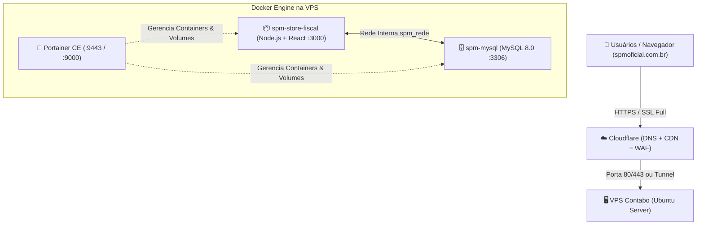

# 🚀 Guia Definitivo de Deploy: VPS Contabo + Docker + Portainer + Cloudflare
### Sistema: SPM Store - Central Fiscal & Gestão de NFs
### Domínio Alvo: `spmoficial.com.br` (ou `fiscal.spmoficial.com.br`)

---

## 📑 Sumário
1. [Visão Geral da Arquitetura](#-1-visão-geral-da-arquitetura)
2. [Passo 1: Preparar a VPS Contabo (Acesso SSH & 1-Click Script)](#-passo-1-preparar-a-vps-contabo)
3. [Passo 2: Configurar o Portainer.io (Interface Web)](#-passo-2-configurar-o-portainerio)
4. [Passo 3: Configurar o Domínio no Cloudflare (DNS + SSL)](#-passo-3-configurar-o-domínio-no-cloudflare)
5. [Passo 4: Sincronização e Importação da Base de Dados](#-passo-4-sincronização-e-importação-da-base-de-dados)
6. [Passo 5: Atualizações Futuras e Manutenção Contínua](#-passo-5-atualizações-futuras-e-manutenção-contínua)

---

## 🏗️ 1. Visão Geral da Arquitetura



---

## 🖥️ Passo 1: Preparar a VPS Contabo

### 1. Conectar na VPS via SSH
Abra o terminal (PowerShell, CMD ou PuTTY) no seu computador e digite:
```bash
ssh root@SEU_IP_DA_CONTABO
```
*(Substitua `SEU_IP_DA_CONTABO` pelo IP que a Contabo enviou no seu e-mail).*

---

### 2. Clonar o Projeto para a VPS
No terminal da VPS, execute:
```bash
cd /opt
git clone https://github.com/SEU_USUARIO/spmfiscal.git
cd /opt/spmfiscal
```
*(Ou envie os arquivos diretamente via SCP/FileZilla para a pasta `/opt/spmfiscal`)*.

---

### 3. Executar o Deploy Automatizado em 1 Comando
Dê permissão de execução e rode o script `deploy.sh`:
```bash
chmod +x deploy.sh
./deploy.sh
```

O script cuidará automaticamente de:
- ✅ Atualizar o sistema operacional (Ubuntu).
- ✅ Instalar Docker e Docker Compose.
- ✅ Subir o painel do **Portainer CE** nas portas `9443` (HTTPS) e `9000` (HTTP).
- ✅ Configurar as regras de segurança no Firewall (UFW).
- ✅ Construir a imagem da aplicação SPM Store Fiscal.
- ✅ Iniciar o MySQL e a aplicação.

---

## 🐳 Passo 2: Configurar o Portainer.io

1. Abra seu navegador e acesse:
   ```
   https://SEU_IP_DA_CONTABO:9443
   ```
   *(Caso apareça aviso de certificado autoassinado, clique em "Avançado" > "Continuar para o site")*.

2. **Crie o seu usuário Administrador** e senha forte.
3. Clique em **"Get Started"** ou selecione o ambiente **Local**.
4. No menu esquerdo, vá em **"Containers"**:
   - Você verá os containers ativos: `spm-store-fiscal`, `spm-mysql` e `portainer`.
5. Se desejar atualizar ou subir novas Stacks:
   - Vá em **"Stacks"** > **"Add Stack"**.
   - Nome: `spm-fiscal-stack`.
   - Cole o conteúdo do arquivo [`docker-compose.portainer.yml`](docker-compose.portainer.yml).
   - Clique em **"Deploy the stack"**.

---

## ☁️ Passo 3: Configurar o Domínio no Cloudflare

### 1. Adicionar o Apontamento DNS
1. Acesse https://dash.cloudflare.com e clique no seu domínio `spmoficial.com.br`.
2. No menu lateral esquerdo, clique em **DNS** > **Records**.
3. Clique no botão **"Add record"**:
   - **Type (Tipo)**: `A`
   - **Name (Nome)**: `@` (para acessar direto como `spmoficial.com.br`) ou `fiscal` (para `fiscal.spmoficial.com.br`).
   - **IPv4 address**: O IP da sua VPS Contabo.
   - **Proxy status**: Deixe ativado como **Proxied (Nuvem Laranja 🟧)** para proteção contra DDoS e SSL automático.
   - **TTL**: Auto.
4. Clique em **Save**.

---

### 2. Configurar o SSL/TLS no Cloudflare
1. No menu esquerdo do Cloudflare, vá em **SSL/TLS**.
2. Na aba **Overview**, marque o modo de criptografia como:
   - **Full** (ou **Flexible** se não tiver certificado local no Nginx).
3. Na aba **Edge Certificates**:
   - Ative **Always Use HTTPS** (Redirecionamento automático de HTTP para HTTPS).
   - Ative **Automatic HTTPS Rewrites**.

---

### 3. Redirecionamento da Porta 3000 para a Porta 80/443 (Nginx Proxy ou Cloudflare Rules)

#### Opção Recomendada (Nginx Proxy Reverso na VPS):
Para que seu domínio `spmoficial.com.br` abra direto na porta padrão 80/443 sem precisar digitar `:3000`, configure o Nginx na VPS:

```bash
apt-get install -y nginx
```

Crie o arquivo de configuração `/etc/nginx/sites-available/spmoficial.conf`:
```nginx
server {
    listen 80;
    server_name spmoficial.com.br fiscal.spmoficial.com.br;

    client_max_body_size 100M;

    location / {
        proxy_pass http://127.0.0.1:3000;
        proxy_http_version 1.1;
        proxy_set_header Upgrade $http_upgrade;
        proxy_set_header Connection 'upgrade';
        proxy_set_header Host $host;
        proxy_cache_bypass $http_upgrade;
        proxy_set_header X-Real-IP $remote_addr;
        proxy_set_header X-Forwarded-For $proxy_add_x_forwarded_for;
        proxy_set_header X-Forwarded-Proto $scheme;
    }
}
```

Ative o site e reinicie o Nginx:
```bash
ln -s /etc/nginx/sites-available/spmoficial.conf /etc/nginx/sites-enabled/
nginx -t && systemctl restart nginx
```

---

## 🗄️ Passo 4: Sincronização e Importação da Base de Dados

Para restaurar ou importar o banco de dados completo com as 2.535+ notas fiscais na VPS:

```bash
# Executa a importação do arquivo SQL diretamente no container MySQL do Docker
docker exec -i spm-mysql mysql -u root -pspm_fiscal_root_pass_2026! spm_fiscal < /opt/spmfiscal/database_spm_fiscal.sql
```

---

## 🔄 Passo 5: Atualizações Futuras (Como Atualizar a Aplicação)

Sempre que fizer alterações no código e quiser atualizar na VPS Contabo, basta rodar:

```bash
cd /opt/spmfiscal
git pull origin main
docker compose build --no-cache spm-fiscal
docker compose up -d spm-fiscal
```
*(Ou no Portainer, basta abrir o Container `spm-store-fiscal`, clicar em **Recreate** com **Pull latest image**)*.

---

## ✅ Resumo das Portas Utilizadas

| Serviço | Porta | Descrição |
| :--- | :--- | :--- |
| **SPM Fiscal** | `3000` / `80` / `443` | Sistema Fiscal & Dashboard Web |
| **Portainer HTTPS** | `9443` | Painel de Gestão dos Containers |
| **Portainer HTTP** | `9000` | Painel de Gestão Alternativo |
| **MySQL Database** | `3306` | Banco de Dados Relacional |
| **SSH** | `22` | Acesso ao Terminal da VPS |
